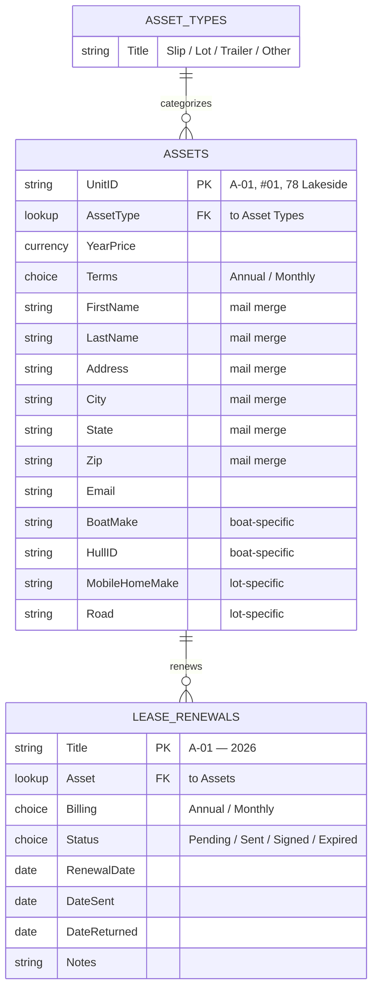
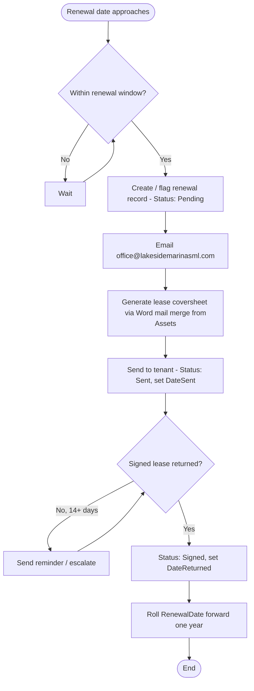
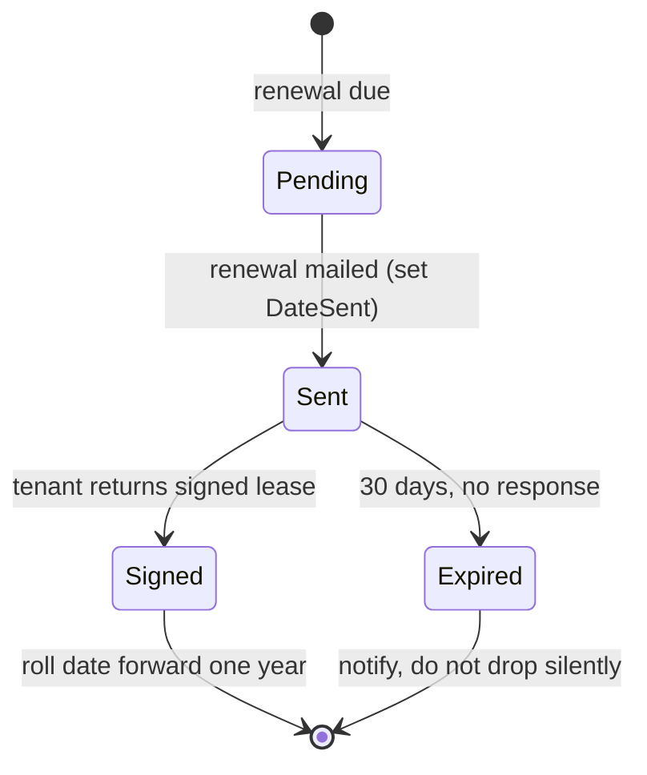

# Process: Lease Renewals — SharePoint Build

Future-state design for the lease renewal system, replacing the Google Calendar
workflow documented in `lease-renewals-legacy.md`. Built from three source files:
`Mobile_Home_Park_List-Map.xlsx`, `Boat_List-Map.xlsx`, and
`Lakeside_Lease_Renewals.xlsx`.

---

## 1. Overview

Tracks lease renewals for every rentable asset — boat slips, mobile home lots, and
other units (e.g. trailers, "78 Lakeside"). A single **Assets** list holds every
unit with its tenant and pricing details and serves as the mail merge source. A
separate **Lease Renewals** list tracks the renewal cycle for each asset, replacing
the Google Calendar where staff currently encode status in the event title. When a
lease nears its renewal date, the office sends a renewal (via Word mail merge),
tracks it as "Sent," and rolls the date forward a year once the signed lease is
returned.

---

## 2. Actors / Roles

| Role                 | Name       | Responsibility                                           |
| -------------------- | ---------- | -------------------------------------------------------- |
| Office Administrator | Amy Dill   | Sends leases out for renewal, records returns            |
| Office Administrator | Jessi Dill | Sends leases out for renewal, records returns            |
| COO                  | Jacob Dill | Reviews data, identifies upcoming renewals, sets pricing |
| System (Flow)        | NA         | Flags upcoming renewals, creates tasks, sends reminders  |

---

## 3. Data Model

> Three lists. **Assets** is the master (and mail merge source). **Lease Renewals**
> is the process tracker, linked to Assets by Lookup. **Asset Types** is a small
> reference list feeding the Type dropdown.

> The ER diagram above shows abbreviated columns for readability — the full column
> list for each list follows below. `PK` = primary key (the Title column in
> SharePoint), `FK` = foreign key (a Lookup column).

### List: Asset Types *(reference / lookup)*

- **Title** — Single line of text — the type name (`Slip` / `Lot` / `Trailer` / `Other`)

### List: Assets *(master — mail merge source)*

> One row per rentable unit. Merges the boat `List` tab and mobile home `List` tab
> into one list. Shared fields are common; asset-specific fields (boat vs. lot) sit
> alongside and are left blank when not applicable. A conditional Power Apps form
> shows only the relevant fields at entry time.

### Core / shared

- **UnitID** — Single line of text — slip/lot identifier (e.g. `A-01`, `#01`, `78 Lakeside`) — *primary key, used as the Title column*
- **AssetType** — Lookup → *Asset Types* list
- **YearPrice** — Currency
- **Terms** — Choice: `Annual` / `Monthly`
- **Notes** — Multiple lines of text

**Tenant contact** *(drives the mail merge)*

- **FirstName** — Single line of text
- **LastName** — Single line of text
- **Address** — Single line of text
- **City** — Single line of text
- **State** — Single line of text
- **Zip** — Single line of text *(store as text to preserve leading zeros)*
- **Phone1** — Single line of text
- **Phone2** — Single line of text
- **Phone3** — Single line of text *(lots only; boats have 2)*
- **Email** — Single line of text
- **Email2** — Single line of text

**Boat-specific** *(blank for lots)*

- **SlipType** — Choice: `Open` / `Covered` — from boat `Type` column
- **SlipLength** — Number — boat `L`
- **SlipWidth** — Number — boat `W`
- **BoatYear** — Number
- **BoatMake** — Single line of text
- **BoatSize** — Single line of text
- **BoatRegistration** — Single line of text — boat `Boat #`
- **BoatName** — Single line of text
- **BoatColor** — Single line of text
- **BoatType** — Single line of text — boat `Type of Boat`
- **HullMaterial** — Single line of text
- **Engine** — Single line of text
- **HullID** — Single line of text

**Lot-specific** *(blank for boats)*

- **RoadNumber** — Single line of text — lot `Road #`
- **Road** — Single line of text
- **MobileHomeMake** — Single line of text — lot `Mobile Home`
- **MobileHomeYear** — Number — lot `Year`
- **MobileHomeSize** — Single line of text — lot `Size`

### List: Lease Renewals *(process tracker)*

> One row per renewal cycle. Replaces the Google Calendar. `Asset` links back to the
> master so tenant/contact details aren't duplicated here.

- **Title** — Single line of text — auto-named (e.g. `A-01 — 2026`)
- **Asset** — Lookup → *Assets* list *(pulls UnitID; tenant/contact come from the master)*
- **Billing** — Choice: `Annual` / `Monthly`
- **Status** — Choice: `Pending` / `Sent` / `Signed` / `Expired`
- **RenewalDate** — Date — the date the renewal is due / sent out
- **DateSent** — Date
- **DateReturned** — Date
- **Notes** — Multiple lines of text

---

## 4. Process Flow

> **Status lifecycle** — the legal transitions for the `Status` choice column on the
> Lease Renewals list. These become the rules the Flow enforces.

---

## 5. Automation Logic

### Flow 1: Detect upcoming renewals

- **Trigger:** Scheduled — daily
- **Condition:** Asset's `RenewalDate` ≤ 60 days out AND no open (`Pending`/`Sent`) renewal exists for that asset
- **Actions:**
  1. Create item in *Lease Renewals* (Status = Pending)
  2. Post Planner task assigned to Office Administrator
  3. Email Office Administrator

### Flow 2: Reminder / escalation

- **Trigger:** Scheduled — daily
- **Condition:** Status = `Sent` AND `DateSent` ≥ 14 days ago
- **Actions:**
  1. Email tenant a reminder
  2. Flag the Planner task as overdue

### Flow 3: Roll forward on return

- **Trigger:** On-change (Status → `Signed`)
- **Condition:** Status changed to `Signed`
- **Actions:**
  1. Set `DateReturned` to today
  2. Set next year's `RenewalDate` on the Asset (or create the next cycle record)

---

## 6. Inputs / Forms

### Form: New / Edit Asset *(Power Apps customized list form)*

- AssetType — dropdown (required) → `AssetType` — *drives which fields show*
- UnitID — text (required) → `UnitID`
- Tenant contact fields — text → contact columns
- Boat fields — shown only when AssetType = Slip
- Lot fields — shown only when AssetType = Lot

### Form: Manual Renewal Request

- Asset — dropdown (required) → `Asset`
- Billing — choice (required) → `Billing`
- Renewal date — date (required) → `RenewalDate`
- Notes — long text (optional) → `Notes`

---

## 7. Business Rules & Edge Cases

- Some tenants are **Monthly**, not Annual (e.g. Zoe Albanese / 78 Lakeside, Kenny). Monthly leases follow the same process as yearly for renewal. Only the billing cycle is different.
- The **Assets list is the mail merge source** — Word pulls First/Last name, Address, City, State, Zip from it. These fields must stay clean and complete or merges break.
- **UnitID formats differ by type** — boats use `A-01`, lots use `#01`, others are freeform (`78 Lakeside`). UnitID stays text; no enforced format.
- A `Signed` renewal rolls the date forward one year — it should never silently disappear (the legacy calendar risk).
- Expired-but-unsigned leases move to `Expired` and trigger a notification.
- Waiting lists and pricing-change history exist as separate tabs in the source files — out of scope for this list, may become their own lists later.

---

## 8. Open Questions and Anwers

- Confirm the renewal window — legacy doc referenced both 45 and 60 days; which is correct?
- One renewals list with a single Asset lookup is the chosen design — confirm no need to ever link a renewal to two assets.
- Where do signed lease PDFs get stored — SharePoint document library, or attached to the renewal list item? Answer: Leases stored as PDF in quickbooks so will not touch this process. A hard copy is filed.
- Should the **mail merge** be kept as Word-on-the-desktop pulling from the list, or eventually moved into Power Automate (auto-generate the document)? I recommend we autogenerate but do this last.
- The boat list has extra tabs (`A Slips`, `Pricing Change`, etc.) that look like map/layout and history views — do any of these need to be preserved as data, or are they just reference?
- Should `Year Price` / pricing live on the Asset, on the Renewal, or both (to keep history)?
- The Rented to: column actually holds the renewal date, not a tenant name (the tenant is in the First/Last Name fields). I mapped it to RenewalDate on that assumption, worth confirming that's right, since it's the center of the whole renewal process. *Answer*: Yes
- 2-11 assets have no renewal date — A-11, A-12, D-01, G-02 through G-05, and the four F-slips. The four F-slips (F-06, F-07, F-10, F-12) also have no tenant, are these just vacant?. The others (A-11, A-12, D-01, G-02–05) have tenants but no date. Is this correct? *Answer*: Yes
- 3-5 monthly-billed lots came through correctly: #02 Williams, #04 Murphy, #05 Hart, #20 Hill, #34 Linck/Evans. Note these are all lots — none of the boat slips were marked monthly in the source, even though Zoe/Kenny came up in conversation. Worth checking whether any slips should be monthly too. My assumption is no monthly boat slips. *Answer*: There is one monthly boat slip, A12 and it needs to be added to the data. 
