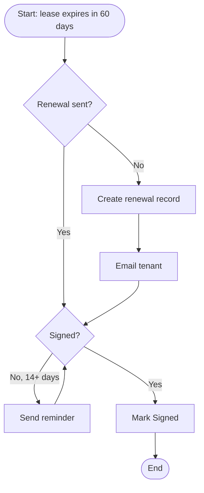
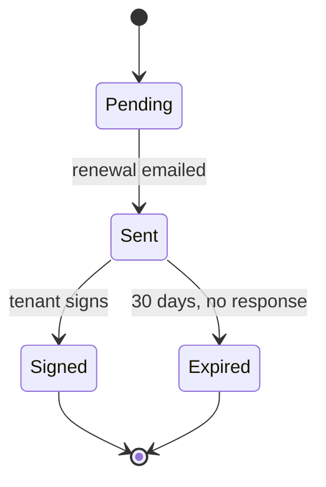
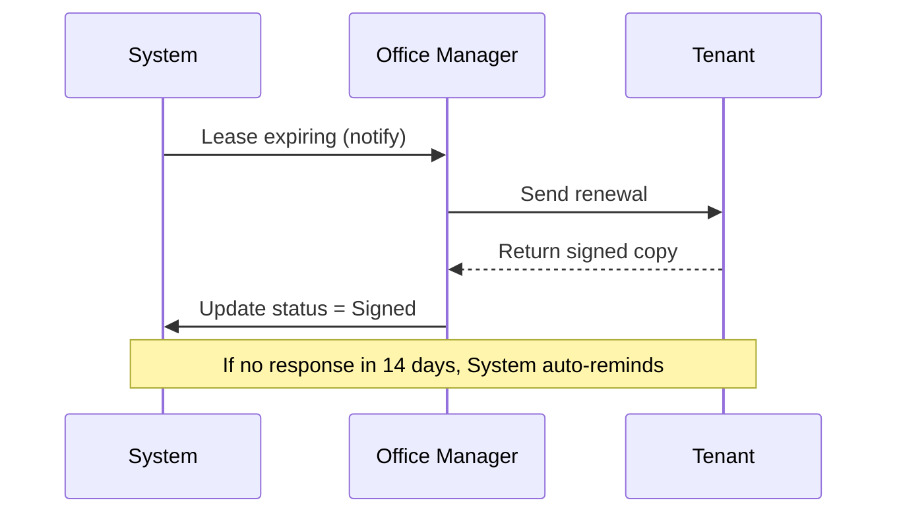
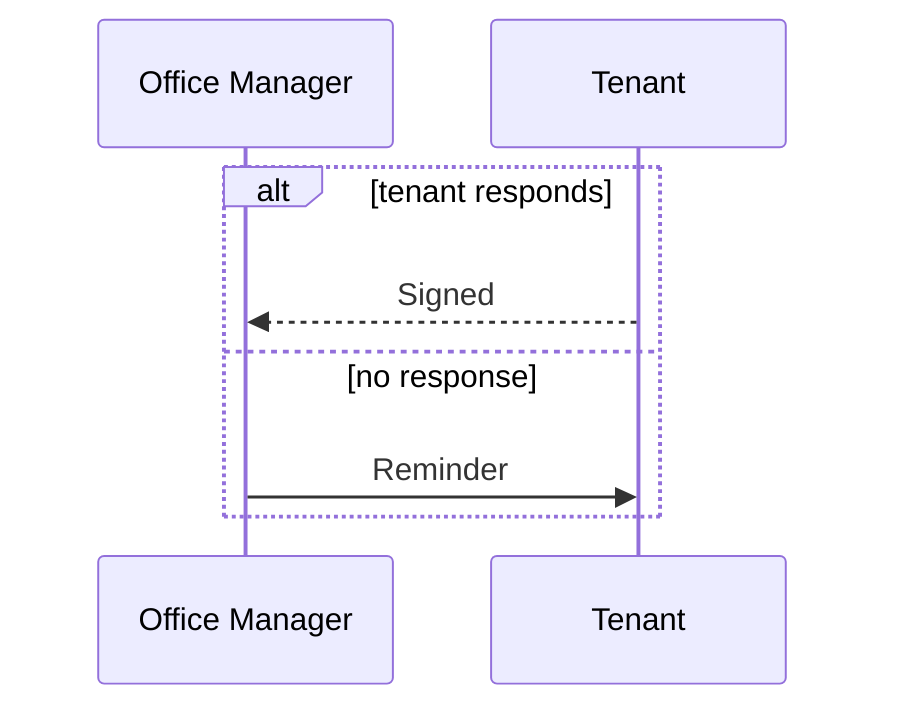
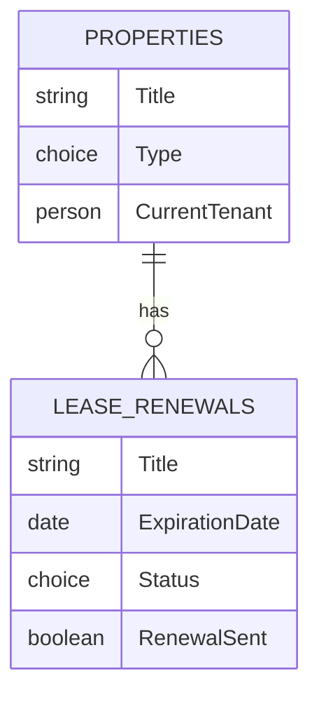

# Mermaid Cheat-Sheet — for Process Docs

> Four diagram types cover ~95% of process documentation. Each one below maps to a
> Power Platform building block, so the diagram doubles as a spec.
> Test any snippet live at **mermaid.live** (paste, see it render instantly) or in
> VS Code with the *Markdown Preview Mermaid Support* extension.
>
> Every Mermaid block is a fenced code block tagged `mermaid`:
> ```` ```mermaid ... ``` ````

---

## 1. Flowchart — process logic → **Power Automate**

The workhorse. Decisions, branches, handoffs. Use this for "what happens when."



**Direction** (after `flowchart`): `TD` top-down · `LR` left-right · `BT` · `RL`

**Node shapes** (the ones you'll use):
| Syntax | Shape | Use for |
|--------|-------|---------|
| `A[Text]` | rectangle | a step / action |
| `A(Text)` | rounded | softer step |
| `A([Text])` | stadium | start / end |
| `A{Text}` | diamond | decision |
| `A[(Text)]` | cylinder | a data store / list |

**Arrows:** `-->` line · `-->|label|` labeled · `-.->` dotted · `==>` thick

---

## 2. State diagram — status lifecycle → **SharePoint Choice column**

If a list item moves through statuses (Pending → Sent → Signed), draw it here. The
states become the *exact* options in your Choice column, and the transitions become
the rules your Flow enforces.



`[*]` is the start/end. Format is `From --> To: label`. This is the single most
useful diagram for handing Claude a Choice column — it can't guess the legal
transitions, but it can read them straight off this.

---

## 3. Sequence diagram — who does what, in order → **actors / handoffs**

Use when the *interaction between people and the system* matters more than the
branching. Great for spotting where a handoff drops or a notification is missing.



**Arrows:** `->>` solid (a request/action) · `-->>` dashed (a reply/return)
**`Note over A,B:`** drops a note spanning participants — handy for edge-case rules.

Optional blocks for conditional flows:


---

## 4. ER diagram — data model → **SharePoint Lists**

This *is* your list schema and the relationships between lists. Define it here and
Claude can scaffold the Lists almost directly.



**Relationship / cardinality** (read left-to-right):
| Symbol | Meaning |
|--------|---------|
| `||--||` | one to exactly one |
| `||--o{` | one to zero-or-many |
| `||--|{` | one to one-or-many |
| `}o--o{` | many to many |

The `o` = optional (zero allowed), `|` = mandatory (at least one). For SharePoint,
`||--o{` (one parent, many children) is what a Lookup column gives you.

---

## When to reach for which

| You're describing… | Use |
|--------------------|-----|
| Branching logic, "if/then" steps | **Flowchart** |
| An item's status as it changes | **State diagram** |
| People + system passing work back and forth | **Sequence** |
| Lists and how they relate | **ER diagram** |

A thorough process doc often uses **flowchart + state + ER together**: the flowchart
shows the logic, the state diagram pins down the Choice column, the ER diagram
defines the Lists. Sequence is the optional fourth when handoffs are the tricky part.

---

## Common gotchas

- **Blank preview = syntax error.** Mermaid fails silently and renders nothing.
  Paste into mermaid.live to get the actual error line.
- **Special characters in labels** (`()`, `:`, `#`) can break parsing — wrap the
  text in quotes: `A["Step (with parens)"]`.
- **Decision diamonds need short labels** or they balloon. Keep `{...}` to a few words.
- **First line declares the type** (`flowchart`, `stateDiagram-v2`, `sequenceDiagram`,
  `erDiagram`) — get this wrong and nothing renders.
- **Indentation doesn't matter** to Mermaid, but stay consistent so it's readable as
  plain text (which is how Claude reads it too).
