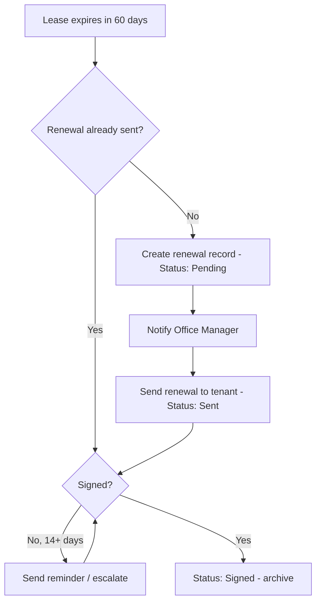

# Process: [Process Name]

> **How to use this file:** Fill in each section below, then hand the whole file to
> Claude and say "build this with SharePoint Lists / Power Automate / Forms."
> Sections are ordered so each one maps to a Power Platform building block:
> Data Model → Lists, Automation → Flow, Inputs → Form. The more you spell out
> the Business Rules and Open Questions, the less Claude has to guess.
> Delete these quote blocks once you're comfortable with the structure.

---

## 1. Overview

> One paragraph: what this process accomplishes and why it exists. Plain English.

*Example:* Tracks lease renewals for slip rentals so no lease lapses unnoticed.
When a lease nears expiration, a renewal is generated, sent to the tenant, and
followed up until signed.

---

## 2. Actors / Roles

> Who touches this process and what they're responsible for. Becomes your
> Person columns, permissions, and task assignments.

| Role | Responsibility |
|------|----------------|
| Office Manager | Reviews renewals, sends to tenant |
| Tenant | Signs and returns renewal |
| System (Flow) | Detects expiring leases, creates tasks, sends reminders |

---

## 3. Data Model

> The heart of the doc — this becomes your SharePoint Lists. One subsection per
> list (entity). For each column give: **name — type — details/choices**.
> Note lookups (relationships to other lists) explicitly.

### List: Lease Renewals
- **Title** — Single line of text — auto-named (e.g. "Slip 14 — 2026")
- **Property** — Lookup → *Properties* list
- **Tenant** — Person
- **Status** — Choice: `Pending` / `Sent` / `Signed` / `Expired`
- **ExpirationDate** — Date
- **RenewalSent** — Yes/No
- **DateSent** — Date
- **Notes** — Multiple lines of text

### List: Properties
- **Title** — Single line of text (slip/lot identifier)
- **Type** — Choice: `Slip` / `Lot` / `Storage`
- **CurrentTenant** — Person

---

## 4. Process Flow

> The visual logic. Mermaid lives in the markdown as text, so Claude reads the
> branching directly — no Visio export or screenshot needed. Keep it focused on
> decisions and handoffs.

---

## 5. Automation Logic

> Written in Flow's own anatomy: **Trigger → Condition → Action**. One block per
> automation. This removes ambiguity about what fires when. Name the trigger type
> (scheduled, on-create, on-change) since that changes how the Flow is built.

### Flow 1: Detect expiring leases
- **Trigger:** Scheduled — daily
- **Condition:** Property lease `ExpirationDate` ≤ 60 days out AND no `Pending`/`Sent` renewal exists
- **Actions:**
  1. Create item in *Lease Renewals* (Status = Pending)
  2. Post Planner task assigned to Office Manager
  3. Email Office Manager

### Flow 2: Reminder / escalation
- **Trigger:** Scheduled — daily
- **Condition:** Status = `Sent` AND `DateSent` ≥ 14 days ago
- **Actions:**
  1. Email tenant a reminder
  2. Flag the Planner task as overdue

---

## 6. Inputs / Forms

> Any place a human enters data. Becomes a Microsoft Form or a Power Apps form.
> List each field, its type, and whether it's required. Note what list/column the
> answer writes to.

### Form: Manual Renewal Request
- Property — dropdown (required) → writes to `Property`
- Tenant name — text (required) → `Tenant`
- Requested expiration — date (required) → `ExpirationDate`
- Notes — long text (optional) → `Notes`

---

## 7. Business Rules & Edge Cases

> The stuff diagrams hide and where AI builds break. Over-document here. Each rule
> as a plain statement. Cover: timing, exceptions, what counts as "done," what
> happens on no-response, who gets notified when something fails.

- A lease is only "renewable" within 90 days of expiration.
- If a tenant doesn't respond in 14 days, send one reminder; after 30 days, escalate to Office Manager.
- A `Signed` renewal creates the *next* year's lease record automatically.
- Expired-but-unsigned leases move to `Expired` and trigger a notification — never silently dropped.
- Only the Office Manager can change Status to `Signed`.

---

## 8. Open Questions

> What you haven't decided yet. Listing these stops Claude from inventing answers
> and silently baking a wrong assumption into the build. Leave them in until resolved.

- Should reminders go to the tenant's email, SMS, or both?
- Do storage units follow the same 60-day window as slips, or a different one?
- Where do signed PDFs get stored — SharePoint doc library or attached to the list item?
